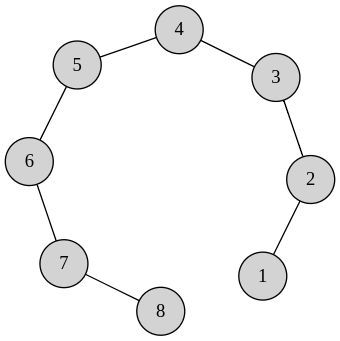
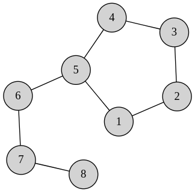
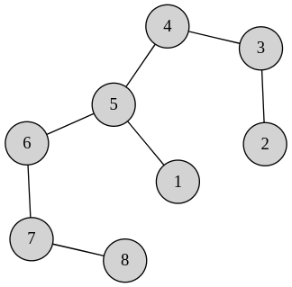

# Como participar

Nesta seção descreveremos os procedimentos para participação e submissão na Rinha de Algoritmos.

## Como submeter

Começar a Rinha de Algoritmos é mamão com açúcar, é só:

1. No seu Terminal, clone esse repositório com o comando `git clone git@github.com:Universidade-Livre/rinha-de-algoritmos`.
2. Crie uma ramificação (branch) no repositório clonado para a resolução do seu exercício com o comando `git checkout -b problema-1`.
3. Na pasta [submissions](./submissions/) crie uma pasta com o seu nome de usuário. Ex: `mateusrovedaa/`
4. Resolva o problema com base nas instruções informadas na seção [Instâncias](#instâncias) e salve o código em um arquivo com o nome `problema-1.ext`, onde `ext` é a extensão da linguagem de programação. Além disso, crie um arquivo `README.md` colocando instruções e detalhes da implementação que achar necessário. Preferencialmente, faça com que o seu código receba o arquivo das instâncias como argumentos no CLI.
5. Ainda, para facilitar a avaliação por parte da organização, crie um ambiente Docker limitando os recursos para duas unidades de CPU e 2GB de RAM, conforme as restrições mencionadas no [README](README.md). 
6. Adicione as alterações feitas para serem enviadas com o comando `git add .`
7. Faça o commit enviando essas alterações `git commit -m "Submissão do problema 01"`.
8. Abra um PR para a ramificação main.

## Instâncias

Para cada problema fornecemos 3 instâncias relativamente pequenas para realizar os experimentos iniciais. As instâncias referentes ao problema $1 \leq i \leq 3$ encontram-se em `resources/instancias/exemplo_0i`. Ainda, todas as pastas contêm um arquivo `resultados.txt` com as soluções ótimas das instâncias dadas, separadas por espaço.

Nas seções abaixo, descreveremos a estrutura dos arquivos de texto que compõem as instâncias e formalizaremos os objetivos e restrições.

## Estrutura dos Problemas

### Problema 01

**Entrada:**

Seja $n$ a quantidade de sementes, $v_{i}$ e $w_{i}$ o valor e a quantidade de espaços necesários para a semente $i$, e $W$ a quantidade de espaços disponíveis. O problema possui os seguintes limitantes. As instâncias estão organizadas da seguinte maneira.

- A primeira linha consiste de dois valores, a quantidade de sementes distintas e a quantidade de espaços disponíveis, respectivamente.

- As $n$ linhas seguintes, onde $n$ é a quantidade de tipos sementes, consistem de dois valores por linha, divididas por espaço. O primeiro é o espaço necessário $w_{i}$ para plantar a semente $i$, já o segundo corresponde ao ganho em moedas $v_{i}$ no final do periodo ao plantar esta semente.

Para todos os tipos de semente, você possui apenas **UMA** unidade!

**Limites:**

- $1 \leq n \leq 1000$
- $30 \leq v_{i} \leq 200$
- $1 \leq w_{i} \leq 7$
- $1 \leq W \leq 2666$

**Objetivo:** 

- Obtenha o lucro máximo possível.

**Exemplo**

Suponhamos que você receba as informações abaixo, e que possui apenas 2 blocos disponíveis pra plantio.

| **Semente** | **Valor** | **Espaço** |
|-------------|-----------|------------|
| Café        | 150       | 1          |
| Arroz       | 260       | 2          |
| Cenoura     | 100       | 1          |

Podemos ver facilmente que a solução ótima é dada pelo plantio de arroz apenas. Perceba que o plantio de duas unidades de café, totalizando um lucro de 300, não é possível pela nossa suposição de haver apenas uma única unidade de cada tipo de semente.

---

### Problema 02

**Entrada:**
- A primeira linha contém dois inteiros: o número de postos avançados $N$ ($2 \leq N \leq 120$) e o número de estradas $M$ ($1 \leq M \leq \frac{N \times (N-1)}{2}$).
- As próximas $M$ linhas contêm dois inteiros cada: $u$ e $v$ ($1 \leq u, v \leq N$), indicando uma estrada conectando os postos avançados $u$ e $v$.

**Saída:**
- A saída deve conter um único inteiro $K$: o número total de postos avançados que definem a muralha

**Objetivo:**
- Maximizar o tamanho da muralha, definida como quantidade de pontos avançados nas extremidades do território, enquanto conecta todas as propriedades do império.

**Exemplo de Entrada 01:**

```plaintext
8 7
1 2
2 3
3 4
4 5
5 6
6 7
7 8
```

A entrada acima pode ser exibida como um grafo, conforme a figura abaixo.



**Exemplo de Saída 01:**
```plaintext
2
```

Neste exemplo, temos que basta utilizarmos todas as estradas disponíveis para traçar todos os postos avançados. Como as sentinelas sempre estarão nas fronteiras, a muralha de tamanho máximo possui tamanho $2$.

Consideremos outro exemplo deste mesmo problema. Desta vez, suponha que há uma estrada entre os postos $5$ e $1$.

**Exemplo de Entrada 02:**

```plaintext
8 8
1 2
2 3
3 4
4 5
5 6
5 1
6 7
7 8
```

A entrada acima pode ser exibida como um grafo, conforme a figura abaixo.



**Exemplo de Saída 02:**
```plaintext
3
```

Neste caso, podemos compor nossa muralha de modo que esta possua tamanho no máximo $3$, conforme podemos observar na figura abaixo.



---

### Problema 03

